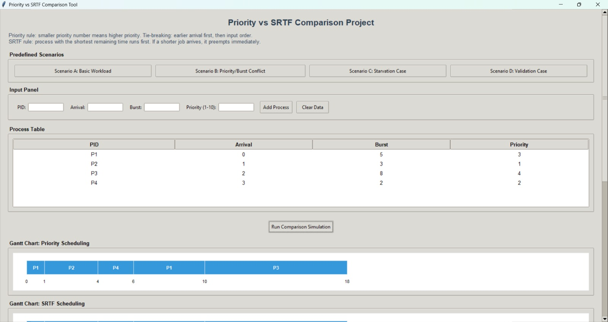
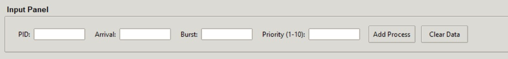
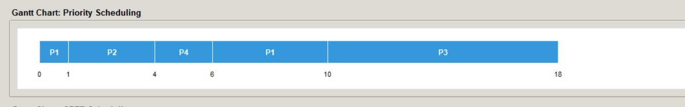
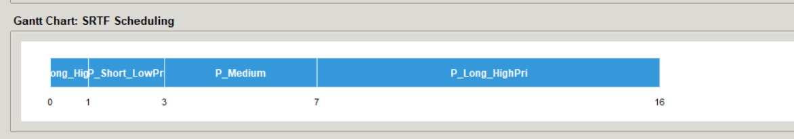
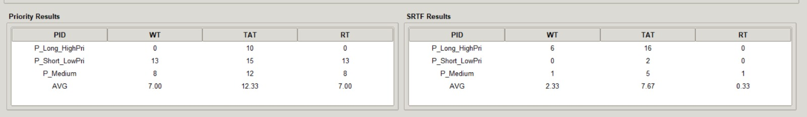
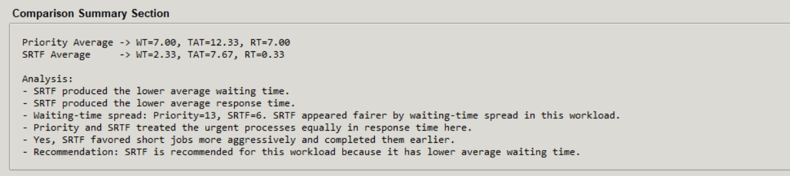

# CPU Scheduling Comparison Project  
## Priority Scheduling vs Shortest Remaining Time First (SRTF)

Operating Systems Course Project

---

## Project Overview

This project is a CPU Scheduling Simulator developed for the Operating Systems course.

It implements and compares two preemptive CPU scheduling algorithms:

- **Priority Scheduling**
- **Shortest Remaining Time First (SRTF)**

The simulator runs both algorithms on the **same workload**, computes scheduling metrics, generates Gantt Charts, and provides a comparison summary explaining the trade-offs between both scheduling policies.

The purpose of this project is to analyze:

- Scheduling efficiency
- Fairness
- Starvation risk
- Response behavior
- Waiting time performance
- Turnaround time performance

---

## Algorithms Implemented

### 1) Priority Scheduling
A preemptive priority-based scheduling algorithm.

### Scheduling Rule:
- Lower priority number = Higher priority  
- Example:

Priority = 1 → highest priority  
Priority = 10 → lowest priority

### Tie Breaking:
If two processes have the same priority:

1. Earlier Arrival Time wins  
2. If arrival time is equal → Input Order wins

### Behavior:
- Supports immediate preemption
- Higher priority arriving process interrupts running process
- Good for urgent tasks
- Can cause starvation for low priority processes

---

### 2) Shortest Remaining Time First (SRTF)
A preemptive shortest-job scheduling algorithm.

### Scheduling Rule:
CPU always selects:

> Process with shortest remaining burst time

### Behavior:
- Supports immediate preemption
- If shorter process arrives → current process is interrupted
- Optimizes average waiting time
- Favors short jobs heavily
- Longer jobs may wait significantly

---

# Features

## Input Panel
User can dynamically enter:

- Process ID
- Arrival Time
- Burst Time
- Priority Value

---

## Validation
The simulator safely rejects invalid inputs such as:

✅ Negative Arrival Time  
✅ Zero Burst Time  
✅ Negative Burst Time  
✅ Empty Process ID  
✅ Duplicate Process ID  
✅ Priority outside valid range (1–10)  
✅ Missing fields  
✅ Non-numeric input in numeric fields

---

## Process Table
Displays all entered processes in a structured table.

Columns:

- PID
- Arrival
- Burst
- Priority

---

## Predefined Test Scenarios
The simulator includes ready-made workloads:

### Scenario A — Basic Mixed Workload
Normal mixed dataset.

### Scenario B — Priority / Burst Conflict
High priority long process vs short low priority process.

### Scenario C — Starvation Sensitive
Designed to observe starvation effects.

### Scenario D — Validation Demo
Invalid data testing.

---

## Gantt Charts
Separate execution visualization for:

- Priority Scheduling
- SRTF Scheduling

Shows:

- execution order
- switching points
- preemption behavior
- total completion timeline

---

## Metrics Calculated

Per process:

- Waiting Time (WT)
- Turnaround Time (TAT)
- Response Time (RT)

Average metrics:

- Average WT
- Average TAT
- Average RT

---

## Comparison Summary
The system automatically analyzes:

- Which algorithm has lower Average WT
- Which algorithm has lower Average RT
- Urgent process treatment
- Short-job favoritism
- Fairness
- Scheduling trade-offs
- Final recommendation

---

## Project Structure

```bash
project/
│
├── main.py
├── gui.py
├── process.py
├── priority_scheduler.py
├── srtf_scheduler.py
├── metrics.py
├── input_validator.py
└── gantt.py
```

---

## Core Logic

### Process Model
Stores:

- PID
- Arrival
- Burst
- Priority
- Remaining Time
- Completion Time
- Waiting Time
- Turnaround Time
- Response Time

---

### Priority Scheduler
Implements:

- Ready Queue
- Priority sorting
- Preemption
- Completion tracking
- Metrics calculation

---

### SRTF Scheduler
Implements:

- Remaining burst tracking
- Dynamic preemption
- Shortest-job selection
- Completion tracking
- Metrics calculation

---

## GUI
Desktop interface built with:

- Python
- Tkinter

Contains:

✅ Input Panel  
✅ Process Table  
✅ Scenario Buttons  
✅ Run Simulation Button  
✅ Gantt Charts  
✅ Result Tables  
✅ Comparison Summary  
✅ Final Conclusion  

---

## Screenshots

## Main Interface

```md

```

---

## Process Input

```md

```

---

## Priority Gantt Chart
```md

```

---

## SRTF Gantt Chart

```md

```

---

## Results Tables

```md

```

---

## Comparison Summary
```md

```

---

## How to Run

Install Python 3.x

Run:

```bash
python main.py
```

or GUI version:

```bash
python gui.py
```

---

## Technical Concepts Covered

- CPU Scheduling
- Preemptive Scheduling
- Ready Queue Management
- Starvation
- Fairness
- Response Time
- Turnaround Time
- Waiting Time
- Scheduling Trade-offs
- Algorithm Comparison

---

## Conclusion

### Priority Scheduling
Better for:

- urgent tasks
- policy-based execution
- real-time prioritization

Weakness:

- starvation risk

---

### SRTF
Better for:

- efficiency
- minimizing average waiting time
- short job optimization

Weakness:

- long jobs may suffer starvation

---

## Final Takeaway

There is no universally best scheduling algorithm.

The best choice depends on:

- workload type
- fairness requirements
- urgency handling
- system goals

Priority Scheduling focuses on **importance**.

SRTF focuses on **efficiency**.

This project demonstrates both trade-offs through simulation and quantitative comparison.
